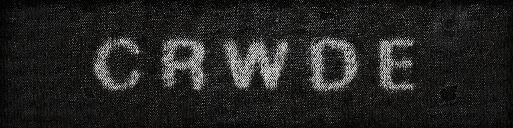
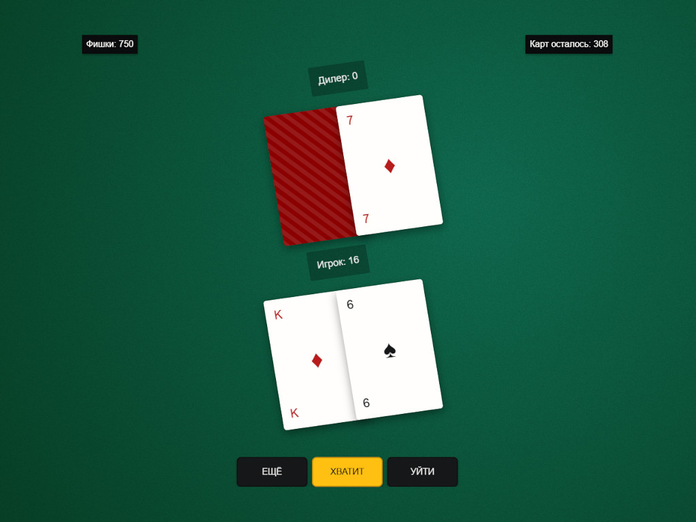
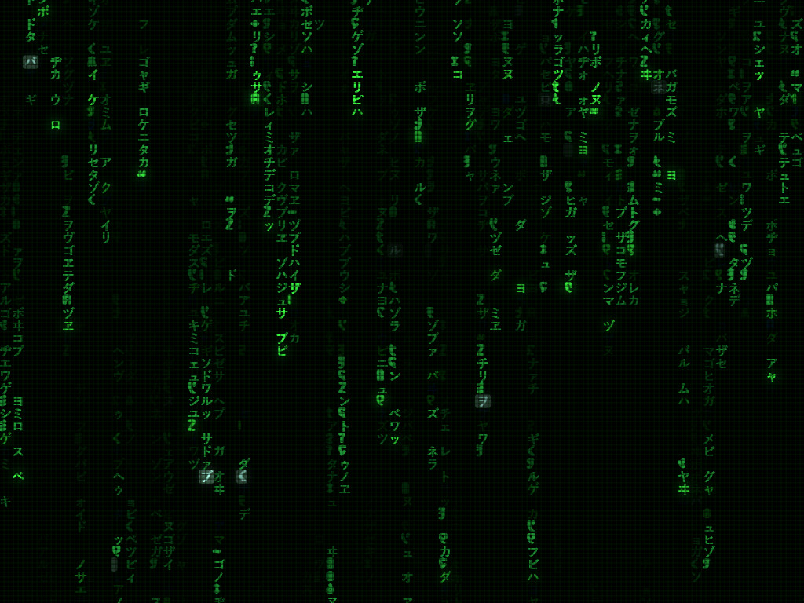

<p align="center">
  
</p>

<h1 align="center">Personal Web Lab</h1>

<p align="center">
  <a href="https://github.com/crwg/crwg.github.io/stargazers" target="_blank"></a>
  <a href="https://github.com/crwg/crwg.github.io/network" target="_blank"></a>
  <a href="https://github.com/crwg/crwg.github.io/blob/master/LICENSE" target="_blank"></a>
  <a href="https://crwg.github.io/poker/" target="_blank"></a>
  <a href="https://crwg.github.io/matrix/" target="_blank"></a>
</p>

<p align="center">
  <a href="#"></a>
  <a href="#"></a>
  <a href="#"></a>
  <a href="#"></a>
</p>

---

## 🌌 Welcome to the Experience

Dive into a world of interactive web magic with two handcrafted projects designed to entertain and inspire.

### 🎴 BlackJack WebGame
A thrilling, fully interactive built with pure JavaScript. Face off against cunning AI opponents, marvel at silky-smooth card animations, and feel the casino vibe from your browser.

- **Highlights**:
  - 🃏 Authentic BlackJack gameplay
  - 🤖 Smart AI
  - 🎰 Stunning card animations
  - 📱 Responsive for desktop and mobile
  - ⚙️ Customize blinds, players, and more

- **Try It Now**: <a href="https://crwg.github.io/poker/" target="_blank">Play BlackJack! 🎲</a>
- **Explore Code**: <a href="https://github.com/crwg/crwg.github.io/tree/master/poker" target="_blank">Source Code 📂</a>

<p align="center">
  <a href="https://crwg.github.io/poker/" target="_blank">
    
  </a>
</p>

<p align="center">
  <a href="assets/poker.jpg" target="_blank">
    
  </a>
</p>

### 🌧️ Matrix Digital Rain
A hypnotic immersive **digital rain** animation inspired by *The Matrix*. Powered by HTML5 Canvas, this project delivers cyberpunk vibes with cascading characters that dance across your screen.

- **Highlights**:
  - 🌌 Randomized, fluid character rain
  - 🎨 Customizable colors, speed, and density
  - ⚡ Optimized for buttery-smooth performance
  - 📱 Scales beautifully on any device
  - 🖼️ Ideal for backgrounds or art installations

- **Try It Now**: <a href="https://crwg.github.io/matrix/" target="_blank">Enter the Matrix! 💾</a>
- **Explore Code**: <a href="https://github.com/crwg/crwg.github.io/tree/master/matrix" target="_blank">Source Code 📂</a>

<p align="center">
  <a href="https://crwg.github.io/matrix/" target="_blank">
    
  </a>
</p>

<p align="center">
  <a href="assets/matrix.jpg" target="_blank">
    
  </a>
</p>
Alright, alright, alright ...

---

## 🚀 Get Started in Seconds

Ready to play or hack? Here's how to run these projects locally:

1. **Clone the Repo**:
   ```bash
   git clone https://github.com/crwg/crwg.github.io.git
   cd crwg.github.io
