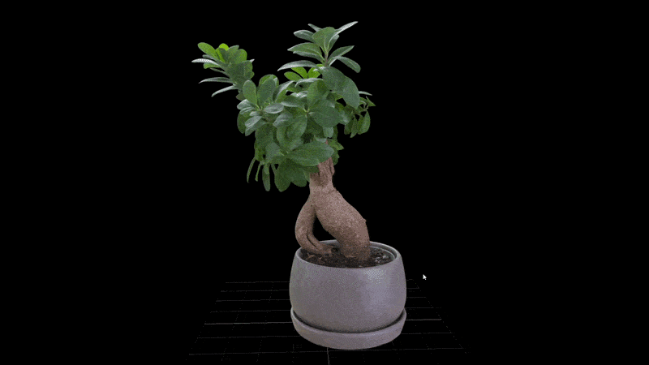
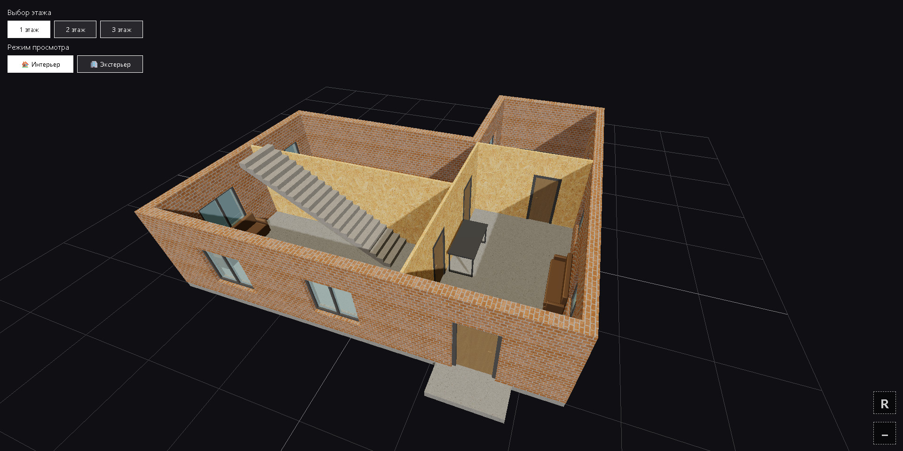
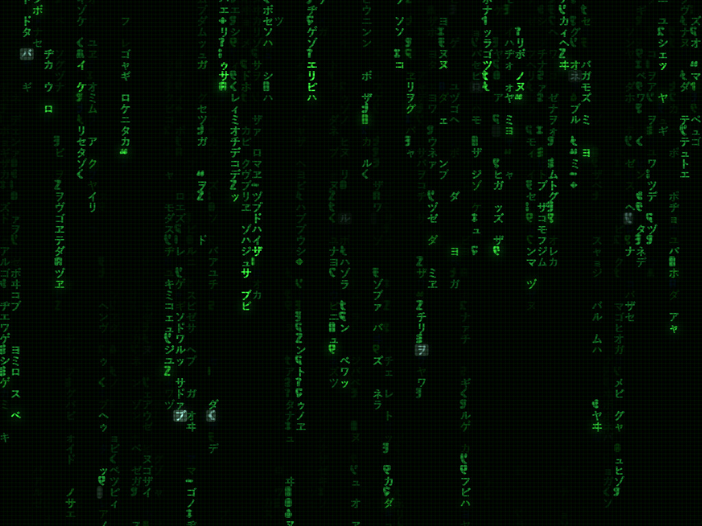
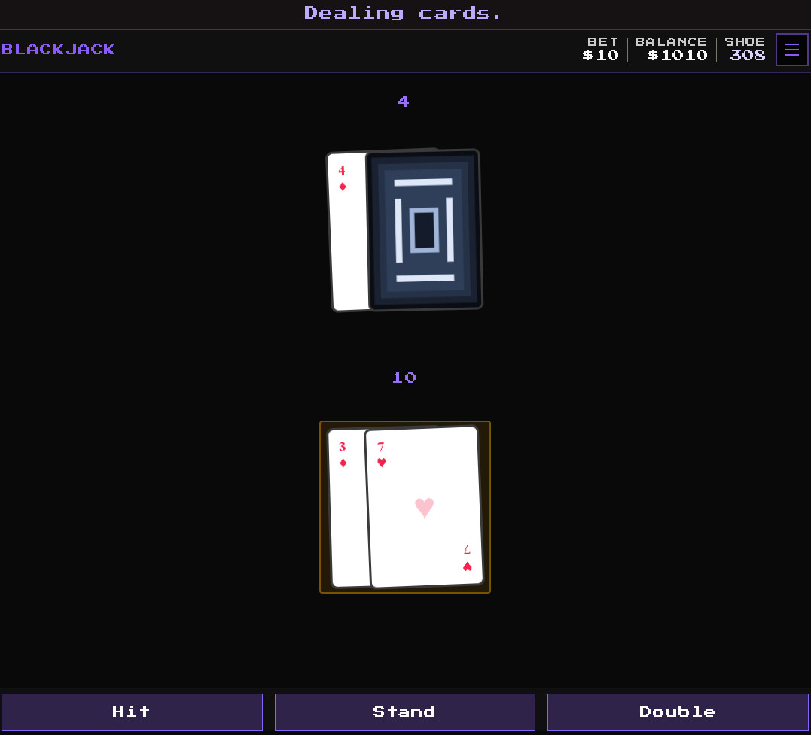

<p align="center">
  
</p>

<a href="README.md">English version</a>

<p align="center">
  <a href="https://github.com/crwg/crwg.github.io/stargazers"></a>
  <a href="https://github.com/crwg/crwg.github.io/network"></a>
  <a href="https://github.com/crwg/crwg.github.io/blob/master/LICENSE"></a>
  <a href="https://crwg.github.io/poker/"></a>
  <a href="https://crwg.github.io/matrix/"></a>
  <a href="https://crwg.github.io/arch/"></a>
</p>

<p align="center">
  <sub>js своейручной сборки | без фреймворков | простой html5 canvas и webgl</sub>
</p>

---

### Простой просмотрщик Gaussian Splat



**демо:** [crwg.github.io/portfolio/GaussianSplat/](https://crwg.github.io/portfolio/GaussianSplat/)  
*позаимствовано у [nazarskalskyi](https://superspl.at/scene/e720a778) — вся заслуга за оригинальный ply ему.*

---

## проекты

### Arch viewer

локальный 3d просмотрщик моделей. управление орбитой, динамические тени, инструменты измерений. вся отрисовка выполняется на устройстве.

<p align="center">
  
  <br/>
  
  <br/>
  <sub>демо: <a href="https://crwg.github.io/arch/">crwg.github.io/arch</a> | исходники: <a href="https://github.com/crwg/crwg.github.io/tree/master/arch">/arch</a></sub>
</p>

---

### Blackjack

карточная игра на чистом js. искуственный интеллект дилера, плавные анимации переворота, адаптивная вёрстка. настраиваемые правила.

<p align="center">
  
  <br/>
  
  <br/>
  <sub>демо: <a href="https://crwg.github.io/poker/">crwg.github.io/poker</a> | исходники: <a href="https://github.com/crwg/crwg.github.io/tree/master/poker">/poker</a></sub>
</p>

---

### Matrix rain

цифровой дождь на canvas. символы катаканы и латиницы, регулируемая скорость / плотность / цвет. плавная работа 60fps.

<p align="center">
  
  <br/>
  
  <br/>
  <sub>демо: <a href="https://crwg.github.io/matrix/">crwg.github.io/matrix</a> | исходники: <a href="https://github.com/crwg/crwg.github.io/tree/master/matrix">/matrix</a></sub>
</p>

---

### очередная карта Blackjack

`игровая площадка для дизайна` – css-переходы, многослойная вёрстка, современный карточный компонент.

<p align="center">
  
  <br/>
  <sub>демо: <a href="https://crwg.github.io/portfolio/design/test-card-1/index.html">crwg.github.io/.../test-card-1</a> | исходники: <a href="https://github.com/crwg/crwg.github.io/tree/master/portfolio/design/test-card-1">/portfolio/design/test-card-1</a></sub>
</p>

---

### Пиксель‑арт Blackjack (улучшенные правила)

`ретро-игра` – 8‑битная графика, староschoolный интерфейс. классический блэкджек с крупными пикселями.

<p align="center">
  
  <br/>
  <sub>демо: <a href="https://crwg.github.io/portfolio/games/blackjack-pixelart/index.html">crwg.github.io/.../blackjack-pixelart</a> | исходники: <a href="https://github.com/crwg/crwg.github.io/tree/master/portfolio/games/blackjack-pixelart">/portfolio/games/blackjack-pixelart</a></sub>
</p>

---

## локальный запуск

```bash
git clone https://github.com/crwg/crwg.github.io.git
cd crwg.github.io
# открой любую папку в браузере, шаг сборки не нужен
